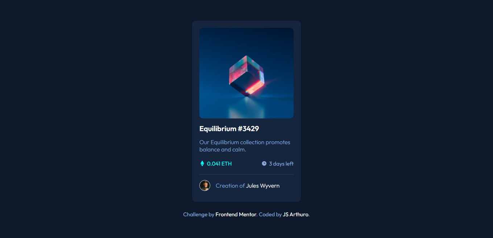

# Frontend Mentor - NFT preview card component solution

This is a solution to the [NFT preview card component challenge on Frontend Mentor](https://www.frontendmentor.io/challenges/nft-preview-card-component-SbdUL_w0U).

## Table of contents

- [Screenshot](#screenshot)
- [Links](#links)
- [Built with](#built-with)
- [Author](#author)

### Screenshot

### Links

- Live Site URL: [nft-preview-card-component](https://jessarthuro.github.io/nft-preview-card-component/)

### Built with

- HTML5
- CSS3
- SASS
- Flexbox

## Author

- Frontend Mentor - [@JessArthuro](https://www.frontendmentor.io/profile/JessArthuro)
- Instagram - [@jess_arthuro](https://www.instagram.com/jess_arthuro/)

